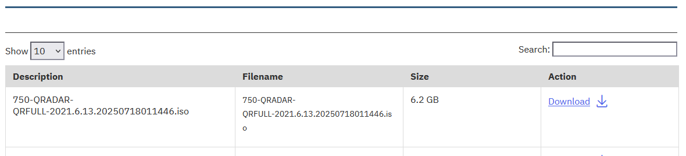

# IBM-QRadar

# Como fazer o download do Qradar Community Edition

**Objetivo:** O propósito deste guia é orientá-lo pelas etapas necessárias para fazer o download do Qradar Community Edition através do site IBM SkillsBuild Software Downloads 

**Tempo estimado:** 5-10 minutos

## Passo 1: Abra o site [IBM Security QRadar Community Edition](https://www.ibm.com/community/101/qradar/ce/) em seu navegador.
 

## Passo 2: Clique em **Download QRadar Community Edition.**

https://www.ibm.com/resources/mrs/assets?S_PKG=ov60294&source=swg-qradarcom

## Passo 3: Siga os passos de login

## Passo 4: Acesse a pagina 'Download the IBM QRadar Community Edition' 

## Passo 4: Na pagina 'Download the IBM QRadar Community Edition' Clique em **Download**

